# RESTful API CRUD dengan PostgreSQL

RESTful API untuk manajemen pengguna dengan autentikasi JWT, upload avatar ke Cloudinary, dan koneksi database PostgreSQL.

- **Nama:** Syahmi Rianta Aswayni
- **Program:** Web Development dan UI/UX Celerates
- **Mentor:** Zaki Maliki

## Deskripsi 

Proyek ini dibuat menggunakan Node.js + Express.js sebagai backend, dengan dukungan:

- JWT Authentication untuk login/registrasi user,

- Cloudinary untuk penyimpanan file avatar,

- PostgreSQL untuk database utama,

- serta Helmet & CORS untuk keamanan dasar server.

Tujuannya adalah membangun fondasi API yang bisa dikembangkan lebih lanjut untuk sistem manajemen user, dashboard admin, atau aplikasi berbasis autentikasi lainnya.

## Fitur 

- **Registrasi & Login (autentikasi JWT)**  
- **Upload Avatar ke Cloudinary**
- **Manajemen data user di PostgreSQL**  
- **Middleware autentikasi & upload file**  
- **:CORS & Helmet untuk keamanan API**  

## Persiapan dan Instalasi

1.  **Clone Repository**
    ```bash
    git clone https://github.com/syahmirian/user_management_api.git
    cd user_management_api
    ```

2.  **Install Dependencies**
    ```bash
    npm install express bcryptjs jsonwebtoken dotenv cors helmet multer cloudinary streamifier pg
    npm install --save-dev nodemon
    ```

3.  **Setup Database**
    Pastikan PostgreSQL server sudah berjalan. Buat database bernama `postgres` lalu jalankan query SQL berikut untuk membuat tabel `users`.
    ```sql
    CREATE TABLE users (
    id SERIAL PRIMARY KEY,
    username VARCHAR(100) UNIQUE NOT NULL,
    email VARCHAR(100) UNIQUE NOT NULL,
    password VARCHAR(255) NOT NULL,
    role VARCHAR(50) DEFAULT 'user',
    avatar_url TEXT

    );
    ```

4.  **Environment Variables**
    Buat file `.env` di root direktori proyek, Sesuaikan dengan konfigurasi PostgreSQL Anda.
    ```env
    PORT=5000
    PGUSER=postgres
    PGHOST=localhost
    PGDATABASE=postgres
    PGPASSWORD=PASSWORD
    PGPORT=5432
    JWT_SECRET=mySecretKey
    CLOUDINARY_CLOUD_NAME=NAMA_CLOUD
    CLOUDINARY_API_KEY=KUNCI_API_CLOUD
    CLOUDINARY_API_SECRET=API_SECRETMU

    ```

5.  **Jalankan Server**
    ```bash
    npm run dev
    ```
    Server akan berjalan di `http://localhost:5000`.

## Preview Screenshots

Berikut hasil pengujian dan struktur project **User Management API**:

---

### Folder Project
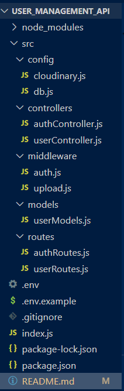

---

### Database di DBeaver
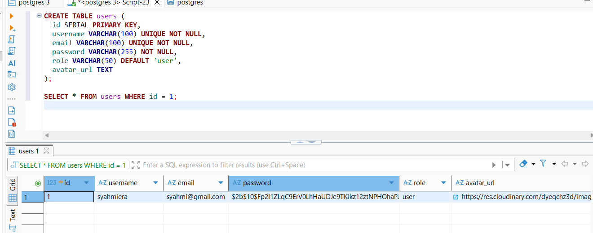

---

### Server Berjalan
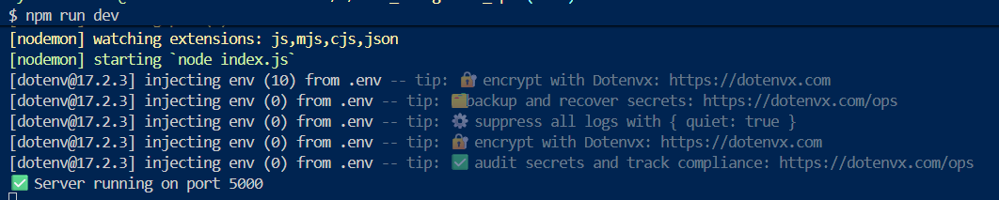

---

## Autentikasi

### Register User
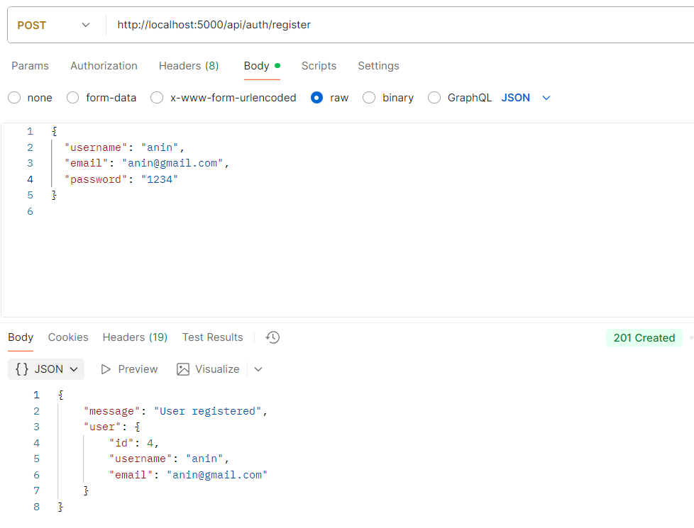

### Login User
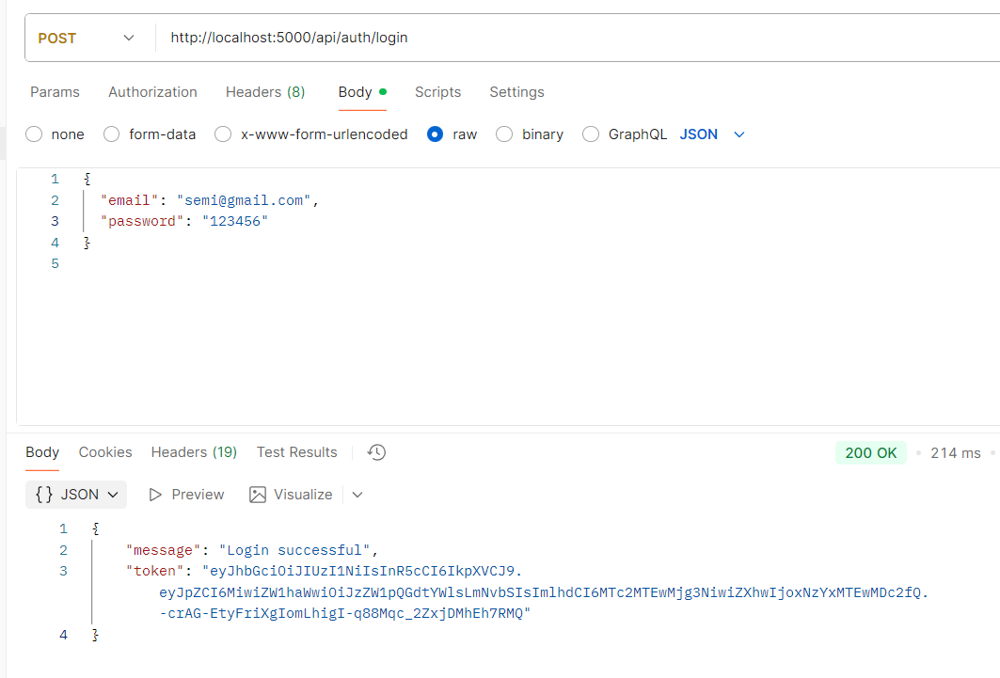

---

## Manajemen User

### Get All Users
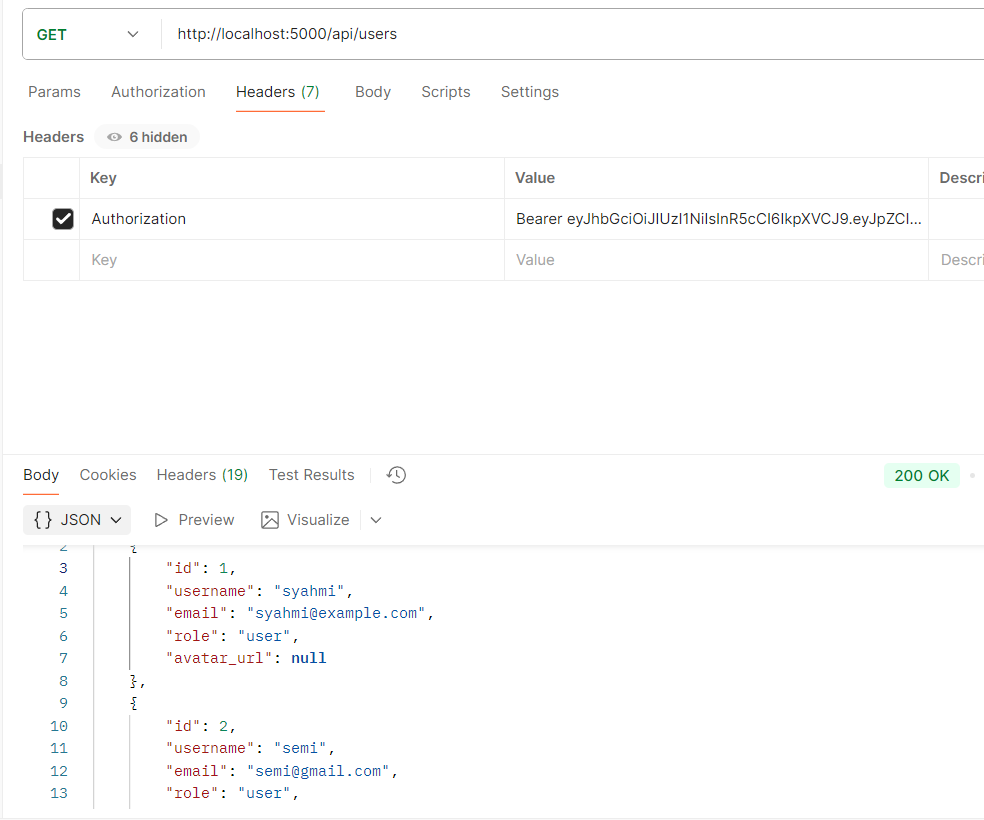

### Update User
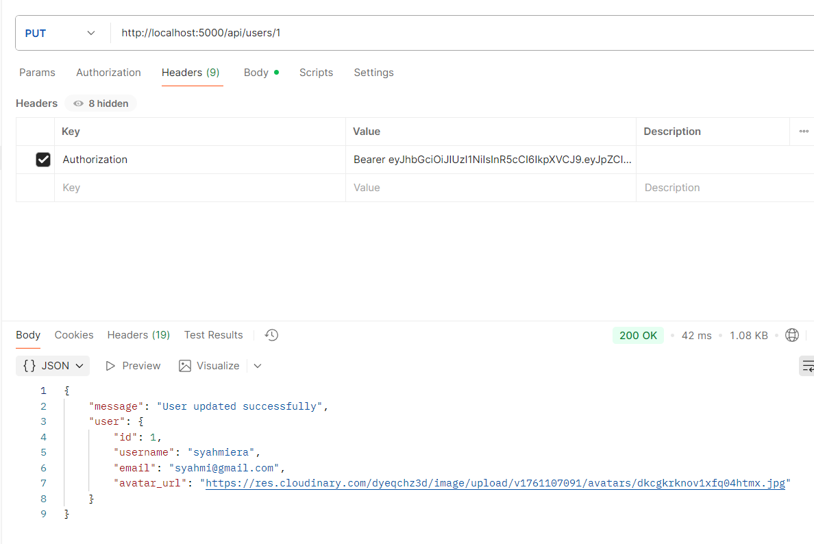

### Delete User
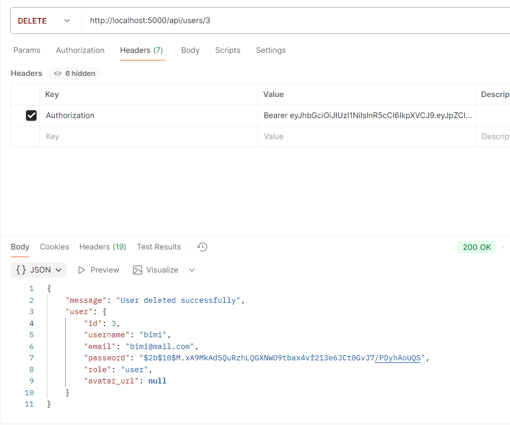

### Get Updated Users (After Update)
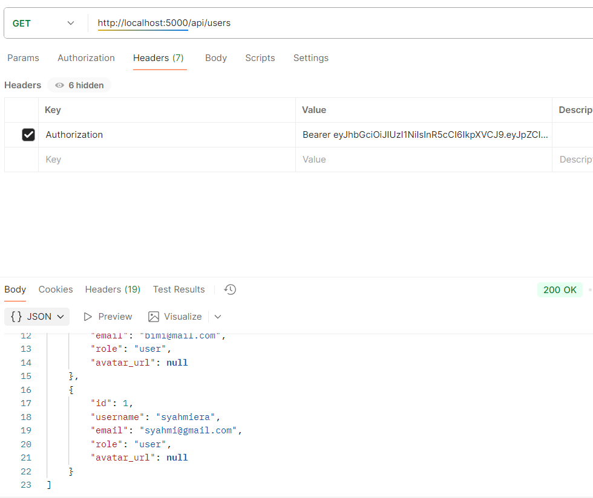

### Get Users After Deleted
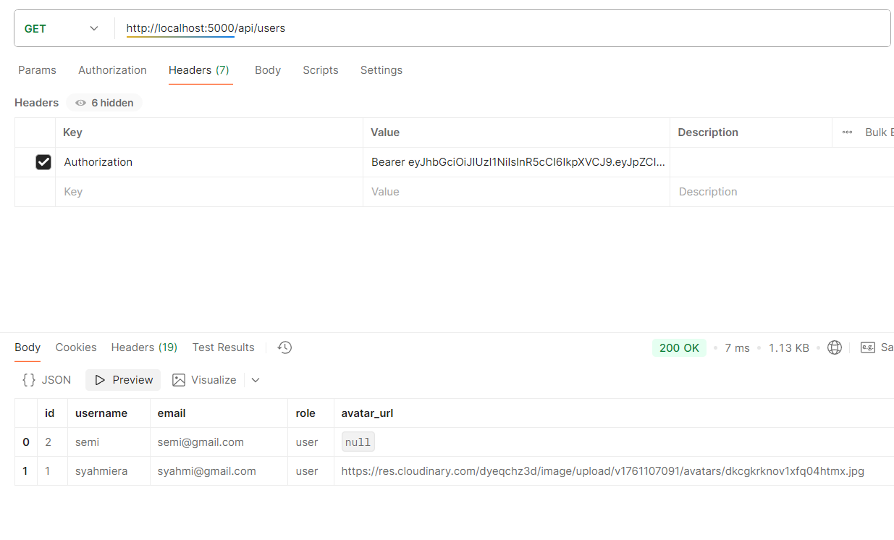

---

## Upload Avatar ke Cloudinary
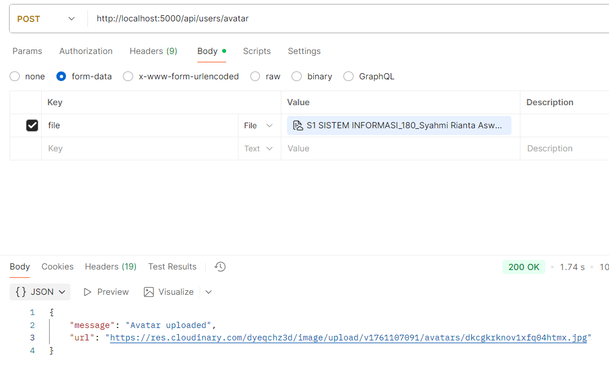

### Hasil Upload Avatar
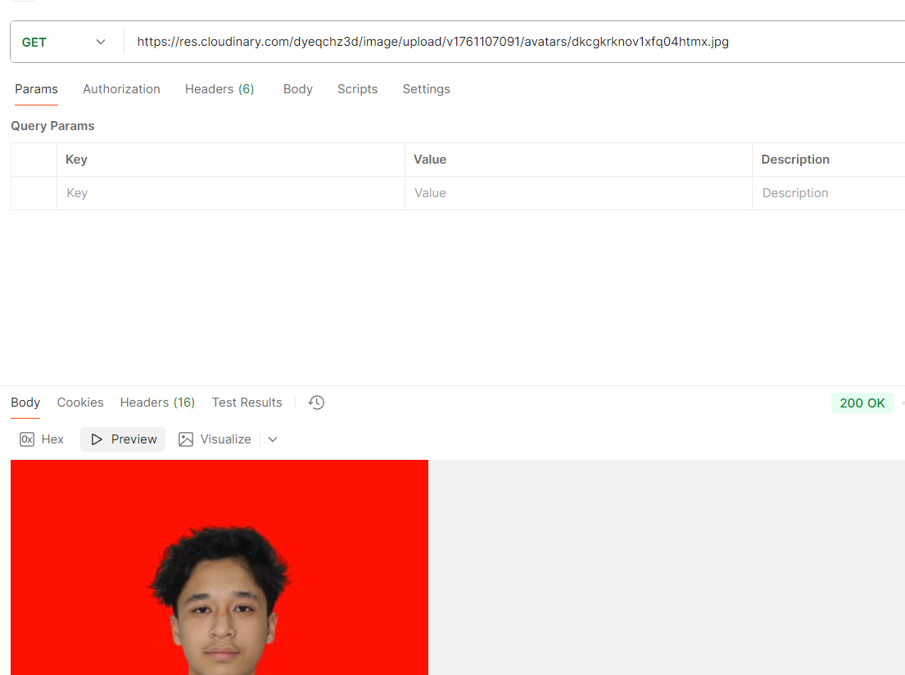

---

